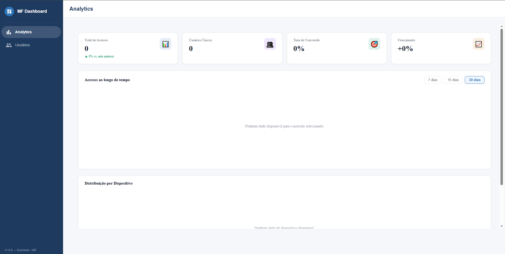

# MF Dashboard — Micro-frontends com Autenticação Keycloak


> Dashboard administrativo baseado em micro-frontends com autenticação via Keycloak. Cada módulo é uma aplicação React independente composta em runtime pelo shell Next.js via Module Federation.



---

## Stack

| Categoria | Tecnologia |
|---|---|
| Runtime | Node.js 20 LTS |
| Linguagem | TypeScript (strict mode) em todos os módulos |
| Shell / Host | Next.js 14 com App Router |
| Micro-frontends | React 18 + Vite + Module Federation |
| Autenticação | Keycloak 23 — OAuth2 + OpenID Connect + JWT |
| UI Principal | Material UI (MUI) v5 |
| UI Secundária | shadcn/ui + Tailwind CSS |
| Gráficos | Recharts |
| Estado Global | Zustand — singleton compartilhado entre módulos |
| HTTP Client | Axios + TanStack Query |
| Formulários | React Hook Form + Zod |
| Testes | Vitest + Testing Library + MSW |
| Containers | Docker + Docker Compose |
| CI/CD | GitHub Actions |

---

## Arquitetura — Fluxo de Autenticação

```
Usuário acessa /dashboard
  │
  ├─ middleware.ts verifica token JWT no cookie
  │
  ├─ Token ausente / expirado
  │    └─ Redireciona para Keycloak login page
  │         └─ Usuário faz login
  │              └─ Keycloak retorna authorization_code
  │                   └─ Shell troca code por access_token + refresh_token
  │                        └─ Salva tokens em cookie HttpOnly
  │                             └─ Redireciona para /dashboard
  │
  └─ Token válido
       └─ Decodifica JWT → extrai roles e dados do usuário
            └─ Renderiza shell com módulos remotos
                 └─ Cada MF recebe token via shared store (Zustand)
```

## Arquitetura — Fluxo do Module Federation

```
Shell (Next.js) inicializa
  │
  ├─ next.config.js define os remotes:
  │    ├─ mfAnalytics: http://localhost:3001/remoteEntry.js
  │    └─ mfUsers:     http://localhost:3002/remoteEntry.js
  │
  ├─ Usuário navega para /dashboard
  │    └─ <RemoteModule module="mfAnalytics/Analytics" />
  │         ├─ Mostra skeleton enquanto carrega
  │         ├─ Webpack busca remoteEntry.js em runtime
  │         └─ Renderiza componente remoto no DOM do shell
  │
  └─ Usuário navega para /dashboard/users
       └─ <RemoteModule module="mfUsers/Users" />
```

---

## Decisões de Arquitetura

**Por que Keycloak em vez de NextAuth?**
Keycloak é o padrão em ambientes corporativos — permite SSO, gerenciamento centralizado de usuários e roles, e integração com diretórios LDAP/Active Directory. NextAuth é excelente para projetos menores, mas não escala para sistemas com múltiplas aplicações e times. Este projeto demonstra exatamente o que equipes de tecnologia de médio e grande porte usam no dia a dia.

**Por que Module Federation em vez de iframes ou npm packages?**
Module Federation permite composição em runtime — cada micro-frontend é deployado e atualizado de forma independente sem precisar republicar o shell. Com iframes há problemas de comunicação e com npm packages o deploy se torna acoplado. Module Federation é a solução de micro-frontend mais adotada em squads de produto.

**Por que Zustand como bridge entre os módulos?**
O Zustand configurado como singleton via `shared` no Module Federation garante que o estado de autenticação é a mesma instância em todos os módulos. Sem isso, cada MF teria seu próprio store isolado e precisaria receber o token via props ou eventos customizados — muito mais frágil.

---

## Como rodar

### Pré-requisitos

- Docker e Docker Compose
- Node.js 20+

### Com Docker (recomendado)

```bash
git clone https://github.com/pedroocastilho/mf-dashboard.git
cd mf-dashboard

docker compose up -d

# Acesse:
# Shell:     http://localhost:3000
# Keycloak:  http://localhost:8080
# Analytics: http://localhost:3001
# Users:     http://localhost:3002
```

### Credenciais de demo

| Usuário | Senha | Role |
|---|---|---|
| admin | admin123 | admin + viewer |
| viewer | viewer123 | viewer |

### Desenvolvimento local

```bash
# 1. Infra
docker compose up -d postgres keycloak

# 2. mf-analytics (terminal 1)
cd mf-analytics && cp .env.example .env && npm install && npm run dev

# 3. mf-users (terminal 2)
cd mf-users && cp .env.example .env && npm install && npm run dev

# 4. Shell (terminal 3)
cd shell && cp .env.example .env && npm install && npm run dev
```

---

## Testes

```bash
# Shell
cd shell && npm test

# mf-analytics
cd mf-analytics && npm test

# mf-users
cd mf-users && npm test
```

**Estratégia:**
- **Unitários:** auth store, decode JWT, keycloak helpers, componentes isolados — Redis e APIs mockados via MSW
- **Integração:** fluxo de token (exchange, refresh, expiração) com MSW interceptando o Keycloak

---

## API Reference

| Método | Rota | Descrição | Autorização |
|---|---|---|---|
| `GET` | `/api/analytics/summary` | KPIs: acessos, usuários únicos, conversão | Bearer token |
| `GET` | `/api/analytics/clicks` | Cliques por dia `?days=7\|15\|30` | Bearer token |
| `GET` | `/api/analytics/devices` | Distribuição por dispositivo | Bearer token |
| `GET` | `/api/users` | Lista usuários com paginação | Role: admin |
| `POST` | `/api/users` | Cria usuário e sincroniza com Keycloak | Role: admin |
| `PUT` | `/api/users/:id` | Atualiza dados e roles | Role: admin |
| `DELETE` | `/api/users/:id` | Remove do banco e do Keycloak | Role: admin |
| `GET` | `/health` | Health check | Público |

---

## Estrutura de pastas

```
mf-dashboard/
├── shell/                    # Next.js 14 — host principal
│   ├── src/
│   │   ├── app/
│   │   │   ├── auth/         # login, callback, logout
│   │   │   └── dashboard/    # página de analytics e users
│   │   ├── components/       # Sidebar, Header, RemoteModule
│   │   ├── lib/              # keycloak.ts, auth.ts, theme.ts
│   │   ├── providers/        # AuthProvider, QueryProvider
│   │   ├── store/            # auth.store.ts (Zustand)
│   │   └── middleware.ts     # proteção de rotas
│   └── tests/
│       ├── unit/             # auth store, keycloak, RemoteModule
│       └── integration/      # fluxo de token, middleware
│
├── mf-analytics/             # React + Vite — módulo remoto
│   └── src/
│       ├── components/       # KpiCards, ClicksChart, DevicesChart
│       ├── services/         # analytics.api.ts + TanStack Query
│       └── tests/
│
├── mf-users/                 # React + Vite — módulo remoto
│   └── src/
│       ├── components/       # UserTable, UserForm, UserFilters
│       ├── services/         # users.api.ts + TanStack Query
│       └── tests/
│
├── keycloak/
│   └── realm-export.json     # realm, client, roles e usuários demo
├── docker-compose.yml
└── .github/workflows/ci.yml
```

---

## Variáveis de Ambiente

### shell/.env

| Variável | Descrição |
|---|---|
| `KEYCLOAK_URL` | URL do Keycloak (ex: http://localhost:8080) |
| `KEYCLOAK_REALM` | Nome do realm (ex: mf-dashboard) |
| `KEYCLOAK_CLIENT_ID` | Client ID (ex: shell-client) |
| `KEYCLOAK_CLIENT_SECRET` | Client secret |
| `NEXT_PUBLIC_BASE_URL` | URL base do shell |
| `MF_ANALYTICS_URL` | URL do mf-analytics |
| `MF_USERS_URL` | URL do mf-users |

---

*Pedro Castilho • castilhodev.com.br • github.com/pedroocastilho*
